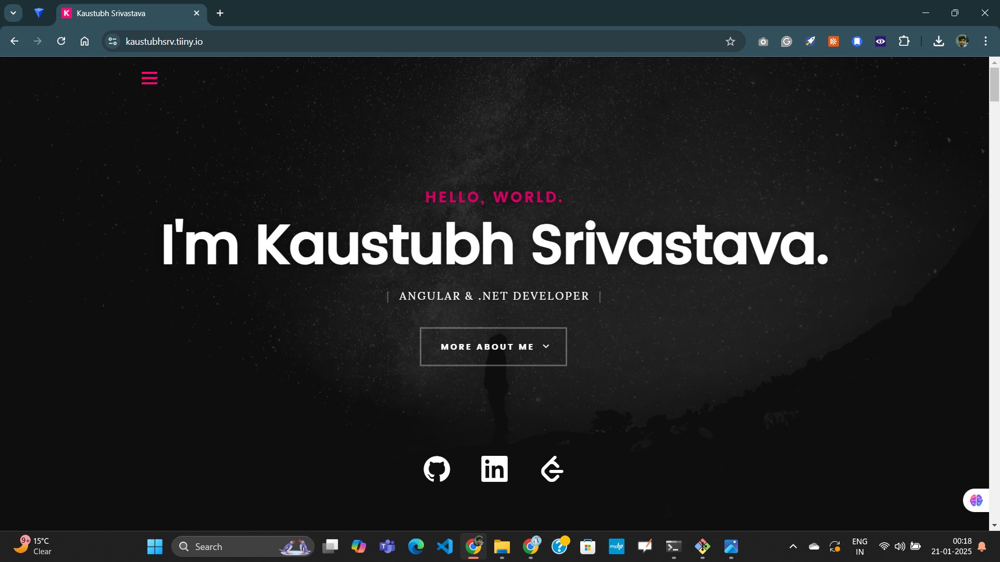

# Portfolio Website

Welcome to my **Portfolio Website**, showcasing my professional journey and projects in **Angular**, **.NET development**, and **PL/SQL development**. This website is designed to provide insights into my work experience, skills, projects and resume. Explore and feel free to reach out through the contact section!

**Website Link**: [Kaustubh Srivastava/](https://apricot-celeste-67.tiiny.io/)

---

## Features

### 🏆 **Showcasing Expertise**
The website highlights my skills in:
- **Angular Development**: Crafting responsive, dynamic, and scalable single-page applications.
- **.NET Development**: Building robust APIs, enterprise solutions, and high-performance applications.
- **PL/SQL Development**: Writing optimized SQL queries, stored procedures, and triggers for seamless database interactions.

### 📂 **Project Portfolio**
Features a dedicated section where I share key projects like **AccountingPro** and **Kostify**, with details on their functionalities, tech stacks, and unique solutions.

### 📜 **Work Experience & Education**
A timeline-style representation of my professional journey, skills acquired, and academic achievements.

### ✉️ **Contact Form**
A functional contact form using **PHPMailer**, allowing visitors to send inquiries directly to my email. (The form ensures secure and validated email delivery.)

---

## Tech Stack & Hosting
- Frontend: HTML5, CSS3, JavaScript
- Backend: PHP (PHPMailer for email functionality)
- Hosting: Tiinyhost

